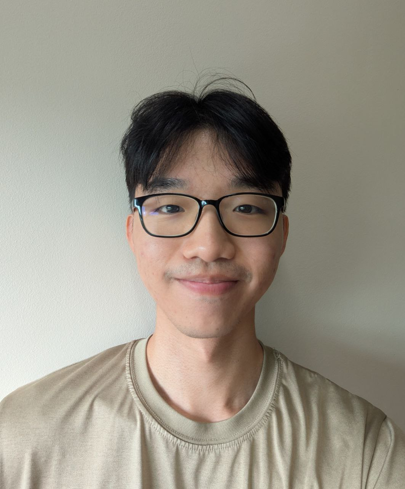
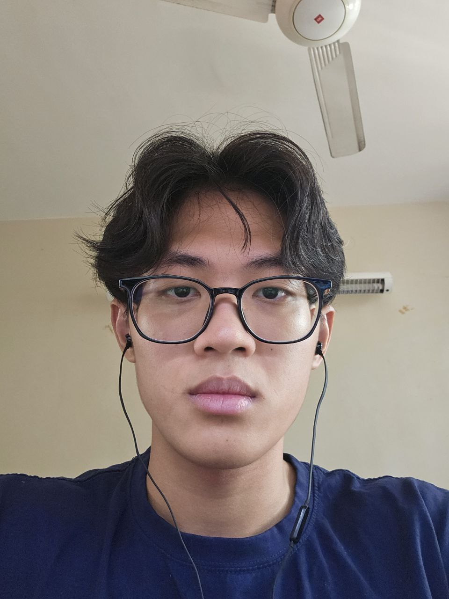
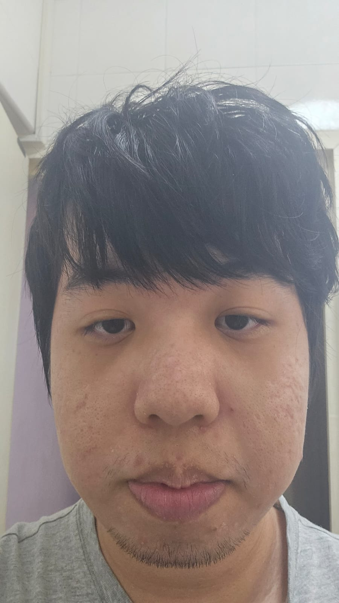
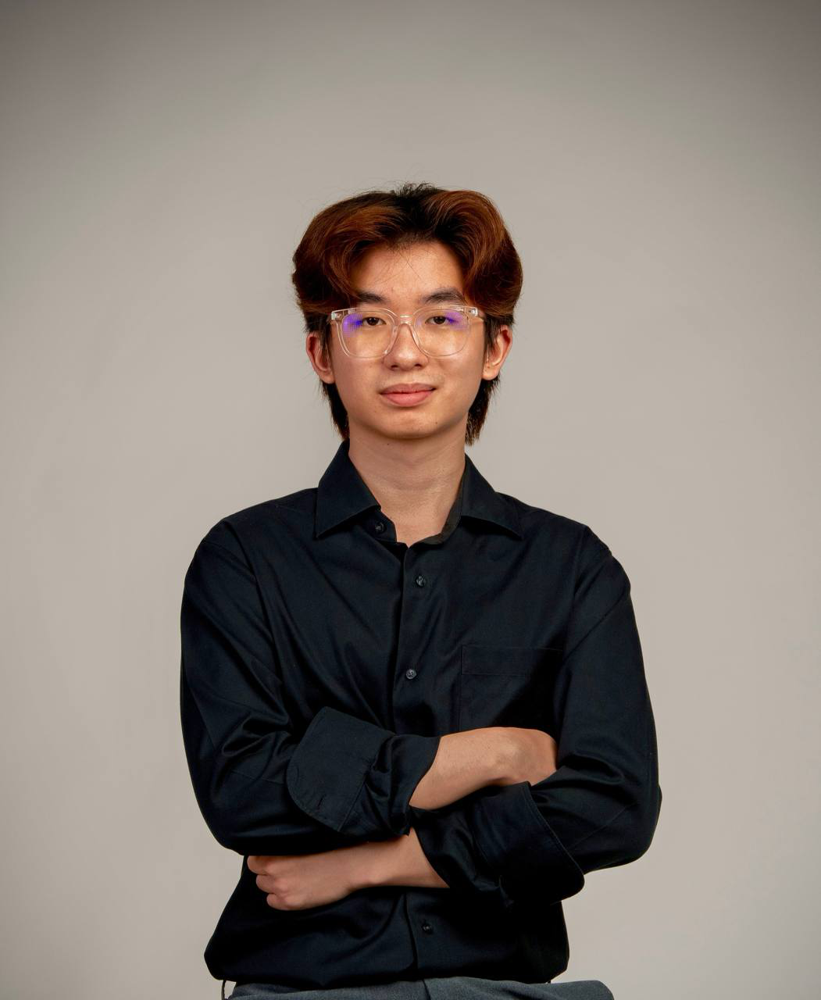
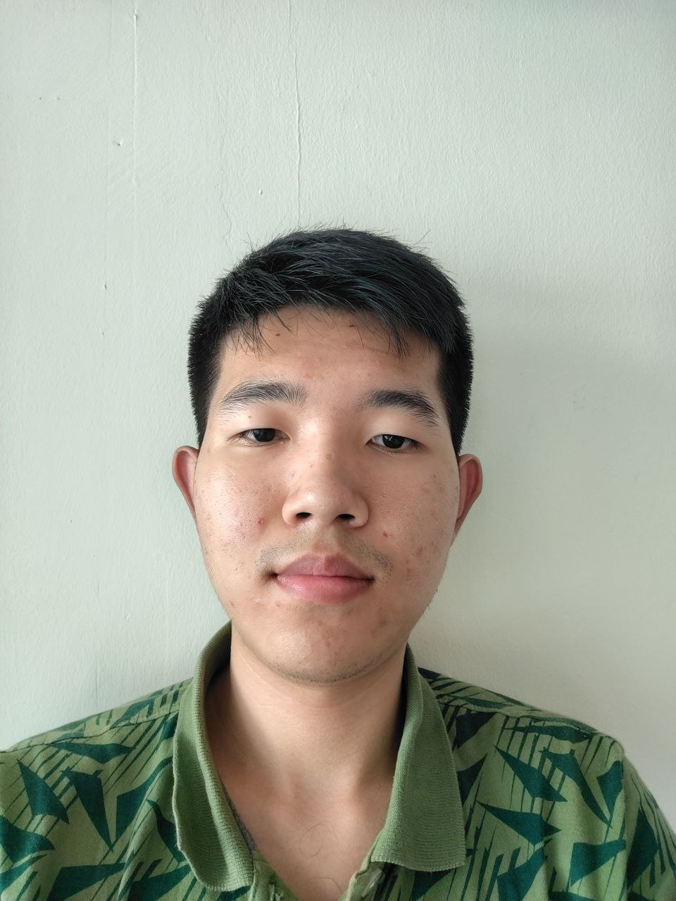

# About Us

We are a team based in the [School of Computing, National University of Singapore](http://www.comp.nus.edu.sg).

## Project team

### Zheng Ting

[[github](https://github.com/mackerelsoup)]

* Role: In charge of logic
* Responsibilities: Add & Free command logic

=======
## Project team

### Zavier

[[github](https://github.com/ZavierCSJ)]

* Role: Deliverables and deadlines
* Responsibilities: Edit command logic

### Zirui

[[github](https://github.com/yzr456)]

* Role: In charge of code quality & logic
* Responsibilities: Command parsing, Subject, & Payment command logic

### Yeo Kai Bin

[[github](https://github.com/kbyeo)]

* Role: Scheduling and tracking
* Responsibilities: UI

### Jin Seng

[[github](https://github.com/TeeJinSeng)]

* Role: Testing
* Responsibilities: Session command logic

