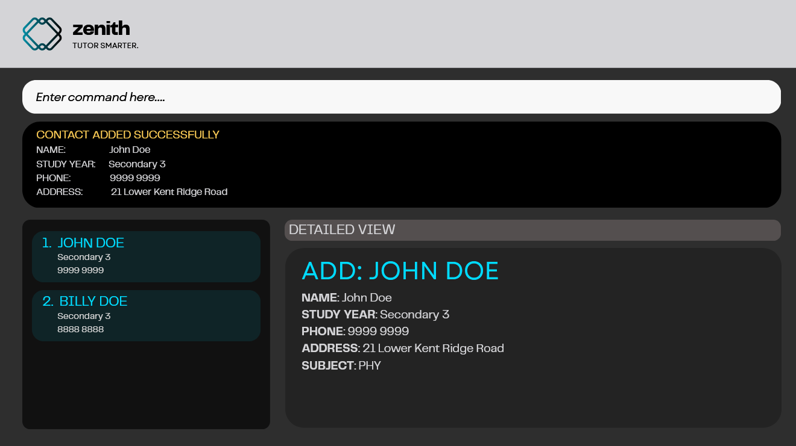
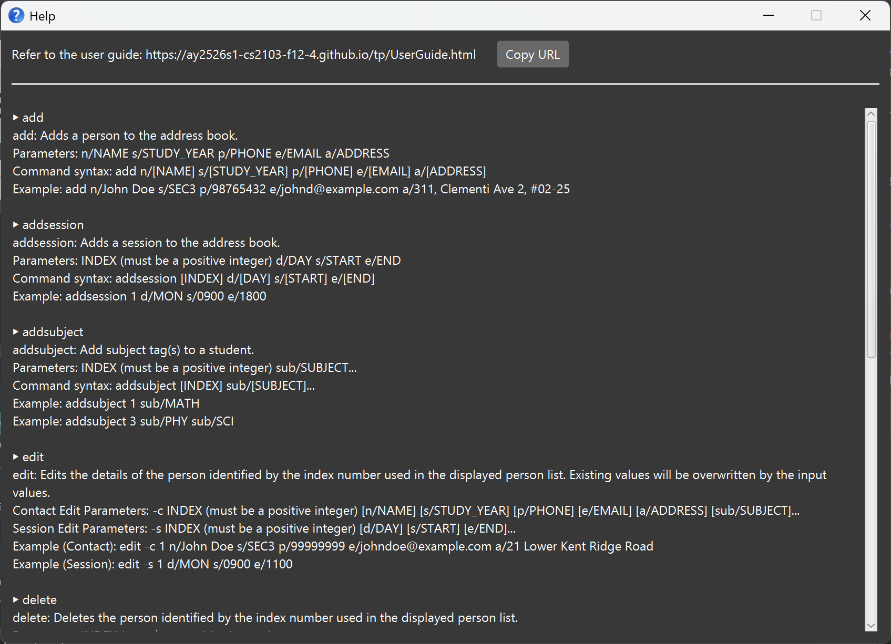
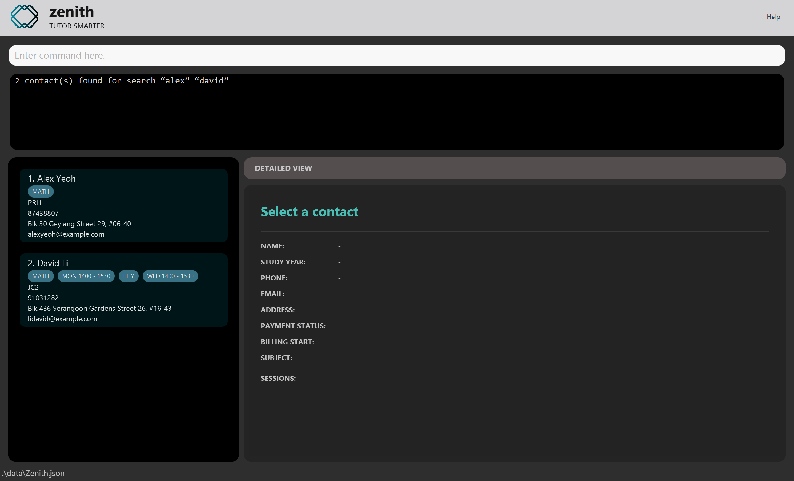

# Zenith User Guide

Zenith is a desktop address book application for a _tech savvy private tutor teaching students in Singapore_, who prefers the use of CLI over GUI for its efficiency and minimalism. It **simplifies tutoring workflow** with a command-line address book that **centralises student details, payments, and optimizes scheduling**, all designed to enhance personalised tutoring through quick, efficient access and management.

<!-- * Table of Contents -->
<page-nav-print />

--------------------------------------------------------------------------------------------------------------------

## Quick start

### 1. Ensure Java is Installed

Zenith requires **Java 17 or above**. Follow these steps to verify:

#### Windows:
1. Open Command Prompt (Press `Win + R`, type `cmd`, press Enter)
2. Type `java -version` and press Enter
3. If you see Java version 17 or higher, you're ready! ✓
4. If not installed, download from [Oracle](https://www.oracle.com/java/technologies/downloads/) and run the installer

#### macOS:
1. Open Terminal (Press `Cmd + Space`, type `terminal`, press Enter)
2. Type `java -version` and press Enter
3. If you see Java version 17 or higher, you're ready! ✓
4. If not installed, follow the [detailed Mac installation guide](https://se-education.org/guides/tutorials/javaInstallationMac.html)

#### Linux:
1. Open Terminal
2. Type `java -version` and press Enter
3. If installed with version 17+, you're ready! ✓
4. If not, run: `sudo apt-get install openjdk-17-jdk` (Ubuntu/Debian) or equivalent for your distribution

### 2. Download Zenith

1. Download the latest `zenith.jar` file from [GitHub Releases](https://github.com/AY2526S1-CS2103-F12-4/tp/releases/)

    _**Note:** The file will typically be saved to your Downloads folder._

2. Create a folder where you want to store Zenith (e.g., `C:\Zenith` or `~/Zenith`)

3. Move the downloaded `zenith.jar` file into this folder

### 3. Run Zenith

#### Windows:
1. Navigate to the folder containing `zenith.jar` in File Explorer
2. Click on the address bar, type `cmd`, and press Enter (this opens Command Prompt in that folder)
3. Type `java -jar zenith.jar` and press Enter

#### macOS:
1. Open Terminal (Press `Cmd + Space`, type `terminal`, press Enter)
2. Type `cd ` (with a space after cd)
3. Drag the folder containing `zenith.jar` into the Terminal window, then press Enter
4. Type `java -jar zenith.jar` and press Enter

#### Linux:
1. Open Terminal
2. Navigate to your Zenith folder: `cd ~/path/to/zenith/folder`
3. Type `java -jar zenith.jar` and press Enter

A GUI similar to the below should appear in a few seconds. The app contains sample student data to help you get started. 

### 4. Try Your First Commands

1. Type the command in the command box and press Enter to execute it. e.g. typing **`help`** and pressing Enter will open the help window. 
   Some example commands you can try:

   * `list` : Lists all contacts.

   * `add n/John Doe s/SEC3 p/98765432 e/johnd@example.com a/311, Clementi Ave 2, #02-25` : Adds a contact named `John Doe` to the address book.

   * `delete 3` : Deletes the 3rd contact shown in the current list.

   * `clear` : Deletes all contacts.

   * `exit` : Exits the app.

1. Refer to the [Features](#features) below for details of each command.

--------------------------------------------------------------------------------------------------------------------
## User Interface

Zenith features a clean, organized interface designed for efficient contact management:

* **Command Box** at the top for entering commands quickly
* **Result Display** directly below shows command feedback and messages
* **Person List** on the lower left provides a summary view of all contacts with key information at a glance
* **Detailed View** on the lower right displays comprehensive information about the selected contact

This layout keeps essential information visible while maintaining a clean, uncluttered workspace that enhances productivity.

### Mouseless Operation

Zenith is designed for tech-savvy private tutors who value keyboard efficiency:

* **From anywhere in the app**, press any typing key or `Ctrl` to instantly jump to the command box and start typing your next command
* **When the Person List is focused**:
    * Press `↑` or `↓` arrow keys to navigate through contacts
    * The Detailed View automatically updates to show the selected contact's information
* **When the Person List is not focused**:
    * Double-tap `↑` or `↓` arrow keys to transfer focus to the Person List
    * The Detailed View will react and display the selected contact

<box type="tip" seamless>

**Tip:** You can use Zenith entirely without a mouse, making it ideal for fast typists who want to maximize efficiency.

</box>

### Mouse Support

While Zenith is optimized for keyboard use, mouse support is fully available:

* **Scroll** through the Person List using your mouse or trackpad
* **Double-click** on any contact in the Person List to view their details in the Detailed View

--------------------------------------------------------------------------------------------------------------------

## Features

<box type="info" seamless>

**Notes about the command format:** 

* Words in `UPPER_CASE` are the parameters to be supplied by the user. 
  e.g. in `add n/NAME`, `NAME` is a parameter which can be used as `add n/John Doe`.

* Items in square brackets are optional. 
  e.g. `setpayment INDEX status/STATUS [start/DAY]` can be used as `setpayment 1 status/OVERDUE start/1` or as `setpayment 1 status/OVERDUE`.

* Items with `…`​ after them can be used multiple times. 
  e.g. `addsubject INDEX sub/SUBJECT…​` can be used as `addsubject 1 sub/MATH`, `addsubject 1 sub/MATH sub/ENG` etc.

* For all commands except `edit -s`, parameters can be in any order. 
  e.g. for the `add` command which specifies `n/NAME p/PHONE_NUMBER`, `p/PHONE_NUMBER n/NAME` is also acceptable.

* Extraneous parameters for commands that do not take in parameters (such as `help`, `list`, `exit` and `clear`) will be ignored. 
  e.g. if the command specifies `help 123`, it will be interpreted as `help`.

* If you are using a PDF version of this document, be careful when copying and pasting commands that span multiple lines as space characters surrounding line-breaks may be omitted when copied over to the application.

</box>

### Viewing help : `help`

Shows a message explaining how to access the help page.

Format: `help`

### Adding a person: `add`

Adds a person to the address book.

Format: `add n/NAME s/STUDY_YEAR p/PHONE_NUMBER e/EMAIL a/ADDRESS`

**Constraints:**
* `NAME`: Alphanumerical characters, spaces, hyphens, apostrophes, not more than 100 characters long.
* `STUDY_YEAR`: Must follow the format `(ACAD_LEVEL)(NUMBER)` where:

| Academic Level | Valid Numbers |
|----------------|---------------|
| PRI            | 1 - 6         |
| SEC            | 1 - 5         |
| JC             | 1 - 2         |
| POLY           | 1 - 3         |
| UNI            | 1 - 5         |

* `EMAIL`: Standard email format.
* `PHONE_NUMBER`: Singaporean mobile number, starts with 8 or 9 and is eight numeric digits long.
* `ADDRESS`: Alphanumerical characters, whitespaces, hyphens, and hashes, not more than 500 characters long.

Examples:
* `add n/John Doe s/PRI1 p/98765432 e/johnd@example.com a/John street, block 123, #01-01`
* `add n/Betsy Crowe s/UNI1 e/betsycrowe@example.com a/Newgate Prison p/84310923`

### Listing all persons : `list`

Shows a list of all persons in the address book.

Format: `list`

### Editing a person : `edit`

Edits an existing student's details or sessions in the address book. This command has two modes: contact editing and session editing.

#### Edit Contact Details: `edit -c`

Edits the contact information and subjects of a student.

Format: `edit -c INDEX [n/NAME] [s/STUDY_YEAR] [p/PHONE] [e/EMAIL] [a/ADDRESS] [sub/SUBJECT]…​`

**Parameters:**
* `INDEX`: The position number of the student in the displayed list and **must be a positive integer** 1, 2, 3, …​ that is smaller or equal to the current address book size.
* `[n/NAME]`: New name for the student (optional, cannot be blank if specified)
* `[s/STUDY_YEAR]`: New study year (optional, cannot be blank if specified)
* `[p/PHONE]`: New phone number (optional, cannot be blank if specified)
* `[e/EMAIL]`: New email address (optional, cannot be blank if specified)
* `[a/ADDRESS]`: New address (optional, cannot be blank if specified)
* `[sub/SUBJECT]…​`: New subjects (optional, can be blank if specified) (multiple subjects can also be specified)

**Notes:**
* At least one optional field must be provided.
* Existing values will be updated to the input values.
* When editing subjects, the existing subjects will be **replaced** (not added to).
* To clear all subjects from a student, use `sub/` with an empty value
* Valid subjects: MATH, ENG, SCI, PHY, CHEM, BIO, HIST, GEOG, LIT, CHI, MALAY, TAMIL, POA, ECONS, ART, MUSIC, COMSCI

Examples:
* `edit -c 1 p/91234567 e/johndoe@example.com`
    - Edits the phone number and email of the 1st student to `91234567` and `johndoe@example.com`
* `edit -c 2 n/Betsy Crower s/JC2`
    - Edits the name to `Betsy Crower` and study year to JC2
* `edit -c 1 sub/MATH sub/PHY`
    - Replaces all existing subjects with Math and Physics only
* `edit -c 1 sub/`
    - Clears all subjects from the 1st student

#### Edit Sessions: `edit -s`

Edits the tutoring sessions of a student.

Format: `edit -s INDEX d/DAY s/START e/END …​`
Format: `edit -s INDEX clear/`

**Parameters:**
* `INDEX`: The position number of the student in the displayed list and **must be a positive integer** 1, 2, 3, …​ that is smaller or equal to the current address book size.
* `d/DAY`: Day of the week (MON, TUE, WED, THU, FRI, SAT, SUN).
* `s/START`: Start time in 24-hour format (e.g., 0900, 1430).
* `e/END`: End time in 24-hour format (e.g., 1100, 1630).

**Notes:**
* `d/DAY s/START e/END` is a parameter group for a session. You can add multiple sessions by repeating the pattern.
* `clear/` can be used to clear all sessions associated with that person.
* Sessions must follow the order: `d/` then `s/` then `e/`.
* You can edit multiple sessions at once by repeating the pattern.
* When editing sessions, **all existing sessions are replaced** with the new ones.
* Sessions cannot overlap with existing sessions for other students.
* Sessions cannot overlap with each other for the same student.

**Examples:**
* `edit -s 1 d/MON s/0900 e/1100`
    - Replaces all sessions for student 1 with a Monday 9am-11am session.
* `edit -s 2 d/TUE s/1400 e/1600 d/THU s/1500 e/1700`
    - Replaces all sessions for student 2 with two sessions: Tuesday 2pm-4pm and Thursday 3pm-5pm.
* `edit -s 1 clear/`
    - Removes all sessions associated with person at index 1.

### Locating persons by name: `find`

Finds persons whose names contain any of the given keywords.

Format: `find KEYWORD [MORE_KEYWORDS]…​`

* The search is case-insensitive. e.g `hans` will match `Hans`.
* The order of the keywords does not matter. e.g. `Hans Bo` will match `Bo Hans`.
* Only the name is searched.
* Partial matches are also shown, `ans` will match `Hans` `ansel`.
* Persons matching at least one keyword will be returned (i.e. `OR` search).
  e.g. `Hans Bo` will return `Hans Gruber`, `Bo Yang`.

Examples:
* `find John` returns `john` and `John Doe`
* `find alex david` returns `Alex Yeoh`, `David Li` 
  

### Adding subject tags : `addsubject`

Adds one or more subject tags to a student's record to track which subjects they are taking.

Format: `addsubject INDEX sub/SUBJECT [sub/MORE_SUBJECTS]…​`

* Adds subject tag(s) to the student at the specified `INDEX`.
* The index refers to the index number shown in the displayed person list.
* The index **must be a positive integer** 1, 2, 3, …​ that is smaller or equal to the current address book size.
* `SUBJECT` must be a valid subject code (case-insensitive).
* You can add multiple subjects at once by repeating the `sub/` prefix.
* Each subject can only be specified once per command.
* Subjects that are already assigned to the student will be rejected.

 <strong>Valid Subject Codes:</strong> 
MATH, ENG, SCI, PHY, CHEM, BIO, HIST, GEOG, LIT, CHI, MALAY, TAMIL, POA, ECONS, ART, MUSIC, COMSCI

Examples:
* `addsubject 1 sub/MATH` adds the MATH subject tag to the 1st student.
* `addsubject 3 sub/PHY sub/SCI` adds both PHY and SCI subject tags to the 3rd student.
* `addsubject 2 sub/ENG sub/LIT sub/HIST` adds multiple humanities subjects to the 2nd student.

 <strong>Tips:</strong> 
If you need to remove or change subjects, use the <code>edit</code> command to modify the student's tags.

### Setting payment status : `setpayment`

Sets and tracks the payment status of a student, including automatic overdue day counting.

Format: `setpayment INDEX status/STATUS [start/DAY]`

* Sets the payment status for the student at the specified `INDEX`.
* The index refers to the index number shown in the displayed person list.
* The index **must be a positive integer** 1, 2, 3, …​ that is smaller or equal to the current address book size.
* `STATUS` must be one of: **PENDING**, **PAID**, or **OVERDUE** (case-insensitive).
* `start/DAY` is optional and `DAY` represents the billing cycle start day (1-31). Defaults to 1 if not specified.
* If status is **OVERDUE**, the system automatically calculates and displays days overdue based on the billing cycle.

<box type="info" seamless>

ℹ️ **Note:** The system does not automatically update a **PENDING** or **PAID** status to **OVERDUE**. You must manually update the payment status when payments become overdue.

</box>

<box type="info" seamless>

ℹ️ **Understanding Days Overdue Calculation:**

The system calculates days overdue based on when the **current billing cycle** started:
* If you set `status/OVERDUE` with `start/DAY` matching today's date, it shows **0 days overdue** because the current billing period just started today.
* Days overdue counts from the most recent occurrence of the billing day. For example:
  * If today is November 15 and billing day is 10, payment is 5 days overdue (from November 10)
  * If today is November 15 and billing day is 15, payment is 0 days overdue (billing period just started)
  * If today is November 15 and billing day is 20, payment is overdue from last month (October 20), showing ~26 days overdue

This helps you track how long a payment has been outstanding within the current billing cycle.

</box>

<box type="info" seamless>

ℹ️ **Handling months with fewer than 31 days:** If you set a billing day greater than the number of days in a month (e.g., day 31 in February), the system automatically adjusts to the last day of that month. For example:
* Billing day 31 → February 28 (or 29 in leap years)
* Billing day 31 → April 30
* Billing day 30 → February 28 (or 29 in leap years)

</box>

Examples:
* `setpayment 1 status/PAID` sets the 1st student's payment status to PAID with default billing cycle (day 1).
* `setpayment 2 status/PENDING start/15` sets the 2nd student's status to PENDING with billing cycle starting on the 15th of each month.
* `setpayment 3 status/OVERDUE` sets the 3rd student's status to OVERDUE and displays how many days overdue the payment is.
* `setpayment 4 status/PAID start/31` sets the 4th student's billing cycle to the 31st (or last day of months with fewer days).
* `setpayment 5 status/OVERDUE start/3` (if today is November 3rd) shows 0 days overdue because the billing cycle just started today.

<box type="tip" seamless>

**Tips:**
* Use `status/PENDING` when awaiting payment, `status/PAID` when confirmed, and `status/OVERDUE` to track late payments.
* The days overdue count helps you prioritize follow-ups with students whose payments are most delayed.

</box>

### Deleting a person : `delete`

Deletes the specified person from the address book.

<box type="warning" seamless>

**Caution:**
This action is irreversible and removes some data from the data file.

</box>

Format: `delete INDEX`

* Deletes the person at the specified `INDEX`.
* The index refers to the index number shown in the displayed person list.
* The index **must be a positive integer** 1, 2, 3, …​ that is smaller or equal to the current address book size.

Examples:
* `list` followed by `delete 2` deletes the 2nd person in the currently displayed address book.
* `find Betsy` followed by `delete 1` deletes the 1st person in the results of the `find` command.

### Adding a session: `addsession`

Adds a session under an existing person in the address book.

Format: `addsession INDEX d/DAY s/START_TIME e/END_TIME`

* Adds a session under the person at the specified `INDEX`. The index refers to the index number shown in the displayed person list. The index **must be a positive integer** 1, 2, 3, …​ that is smaller or equal to the current address book size.
* The session to be added must not overlap with any other sessions that is added to the address book unless it is the same exact session. The idea is that we are allowing multiple students to attend the same session but a session cannot begin when another is ongoing.
* `DAY` must be one of: `MON`, `TUE`, `WED`, `THU`, `FRI`, `SAT`, `SUN`(case-insensitive).
* `START_TIME` and `END_TIME` must be in `HHmm` (e.g., 0900, 1730) with digits only.
* `START_TIME` and `END_TIME` must be between `0800` and `2200` on the same day, `START_TIME` must earlier than `END_TIME`, with a minimum duration of 15 minutes.

Examples:
* `addsession 1 d/MON s/1100 e/1200` Adds a weekly session on Monday 1100 - 1200 under the 1st person in the list.
* `addsession 2 d/sun s/1745 e/1800`Adds a weekly session on Sunday 1745 - 1800 under the 2nd person in the list.

### Finding a free session : `free`

Finds the earliest free session in the week from the address book.

Format: `free DURATION`

* Finds the **earliest** free session of the specified `DURATION`.
* `DURATION` refers to any integer between 1 - 14 hours given that valid session times are from 0800 - 2200 daily.
* This implementation of free will greedily find the earliest free time slot that meets the minimum duration.

Examples:
_These are independent examples assuming that 1. The person we are trying to add sessions to exists 2. There are currently no sessions in the address book._
* `addsession 1 d/MON s/0800 e/1100`, `addsession 1 d/MON s/1600 e/1800` followed by `free 4` returns `MONDAY 11:00`
* `addsession 1 d/MON s/0800 e/1100`, `addsession 1 d/TUE s/1600 e/1800` followed by `free 12` returns `WEDNESDAY 08:00`

### Clearing all entries : `clear`

Clears all entries from the address book after confirmation.

<box type="warning" seamless>

**Caution:**
This action is irreversible and will remove all data from the data file. 

</box>

Format: `clear`

**How it works:**
1. Enter `clear` command - you will be prompted to confirm this action
2. Type `y` to confirm and delete all entries, or `n` to cancel
3. Any other input will be treated as invalid and you'll need to start over

Examples:
* `clear` followed by `y` - clears all entries
* `clear` followed by `n` - cancels the clear operation and keeps all data

<box type="tip" seamless>

**Tip:** The confirmation step helps prevent accidental data loss. Make sure you really want to delete all entries before typing `y`.

</box>

### Exiting the program : `exit`

Exits the program.

Format: `exit`

### Saving the data

Zenith contact data are saved in the hard disk automatically after any command that changes the data. There is no need to save manually.

### Editing the data file

Zenith contact data are saved automatically as a JSON file `(JAR file location)/data/Zenith.json`. Advanced users are welcome to update data directly by editing that data file.

<box type="warning" seamless>

**Caution:**
If your changes to the data file makes its format invalid, Zenith will display an error message and start with an empty address book. 
The invalid data file will remain unchanged until you perform any operation, at which point the file will be overwritten with the new data. Hence, it is recommended to take a backup of the file before editing it, and if you see an error message on startup, you can restore your backup before making any changes. 
Furthermore, certain edits can cause Zenith to behave in unexpected ways (e.g., if a value entered is outside the acceptable range). Therefore, edit the data file only if you are confident that you can update it correctly. 

</box>

--------------------------------------------------------------------------------------------------------------------

## FAQ

**Q**: How do I transfer my data to another computer? 
**A**: Install the app in the other computer and overwrite zenith.json which is found in the data folder in the same directory as zenith.jar, with your edited zenith.json file.

--------------------------------------------------------------------------------------------------------------------

## Command summary

| Action           | Format, Examples                                                                                                                                            |
|------------------|-------------------------------------------------------------------------------------------------------------------------------------------------------------|
| **Add**          | `add n/NAME s/STUDY_YEAR p/PHONE_NUMBER e/EMAIL a/ADDRESS`   e.g., `add n/John Doe s/SEC3 p/98765432 e/johnd@example.com a/John street, block 123, #01-01` |
| **Add Session**  | `addsession INDEX d/DAY s/START e/END`   e.g., `addsession 1 d/MON s/0900 e/1100`                                                                        |
| **Add Subject**  | `addsubject INDEX sub/SUBJECT [sub/MORE_SUBJECTS]…​`   e.g., `addsubject 1 sub/MATH sub/SCI`                                                             |
| **Clear**        | `clear`                                                                                                                                                     |
| **Delete**       | `delete INDEX`   e.g., `delete 3`                                                                                                                        |
| **Edit Contact** | `edit -c INDEX [n/NAME] [s/STUDY_YEAR] [p/PHONE] [e/EMAIL] [a/ADDRESS] [sub/SUBJECT]…​`   e.g., `edit -c 1 n/John Doe p/91234567`                        |
| **Edit Session** | `edit -s INDEX d/DAY s/START e/END …​` or `edit -s INDEX clear/`   e.g., `edit -s 1 d/MON s/0900 e/1100` or `edit -s 1 clear/`                           |
| **Exit**         | `exit`                                                                                                                                                      |
| **Find**         | `find KEYWORD [MORE_KEYWORDS]…​`   e.g., `find John David`                                                                                               |
| **Free**         | `free DURATION`   e.g., `free 4`                                                                                                                         |
| **Help**         | `help`                                                                                                                                                      |
| **List**         | `list`                                                                                                                                                      |
| **Set Payment**  | `setpayment INDEX status/STATUS [start/DAY]`   e.g., `setpayment 1 status/PAID start/15`                                                                 |

